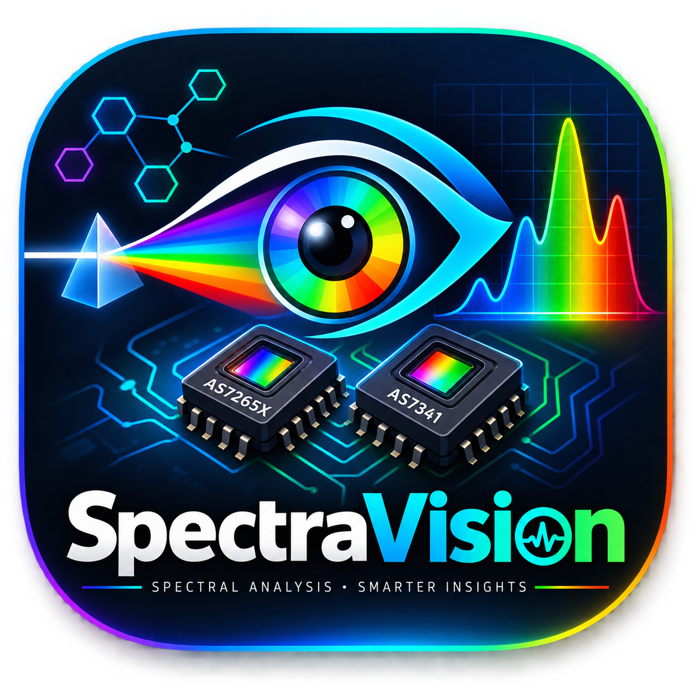

<div align="center">



# SpectraVision

**Real-time spectral sensor monitoring & analysis — mobile dashboard.**

A React Native + Expo app that streams live readings from the **AS7265X** (18-channel) and **AS7341** (10-channel) spectral sensors via **Firebase Realtime Database**, rendering them as interactive, dark-mode science-instrument charts.

[Live data path: `https://spectral-a59ca-default-rtdb.firebaseio.com/spectral_readings`] · [Expo SDK 54] · [TypeScript]

---

</div>

## Overview

| Property           | Value                                                                        |
| ------------------ | ---------------------------------------------------------------------------- |
| **Platform**       | Android · iOS · Web                                                          |
| **UI mode**        | Dark theme (science-instrument style)                                        |
| **Data source**    | Firebase Realtime Database                                                   |
| **Sensors**        | AS7265X triad (410–940 nm, 18 ch) · AS7341 (415–680 nm + Clear + NIR, 10 ch) |
| **Spectrum range** | 410–940 nm (28 channels combined)                                            |
| **Expo SDK**       | 54                                                                           |

## Screens

| Screen         | Route              | Purpose                                                           |
| -------------- | ------------------ | ----------------------------------------------------------------- |
| Dashboard `🏠` | `/` → `/dashboard` | Live combined spectral curve + 28-channel overlay + sensor status |
| Combined `🔄`  | `/combine`         | Per-sensor curves with legend toggle & realtime history           |
| AS7265X `🔬`   | `/as7265x`         | 18-channel intensity chart (410–940 nm)                           |
| AS7341 `🔔`    | `/as7341`          | 10-channel raw counts (415–680 nm + Clear + NIR)                  |
| History `📜`   | `/history`         | Detection log with CSV export                                     |

## Install & run

```bash
npm install
npx expo start
```

Scan the QR code, or press `a` for Android / `i` for iOS / `w` for web.

## Build

### Local (Gradle)

```bash
npx expo prebuild --platform android
cd android
./gradlew assembleRelease
# → android/app/build/outputs/apk/release/app-release.apk
```

### EAS

```bash
npm install -g eas-cli
eas login
eas build --platform android --profile preview
```

## Architecture

```
app/
  _layout.tsx
  index.tsx                  → redirect → /dashboard
  (tabs)/
    dashboard.tsx
    combine.tsx
    as7265x.tsx
    as7341.tsx
    history.tsx
components/
  InteractiveChart.tsx       → zoomable, pannable multi-series chart (react-native-chart-kit + SVG)
  SpectralBarChart.tsx
  SpectralLineChart.tsx
  StatCard.tsx
  SensorBadge.tsx
hooks/
  useLatestReading.ts        → onValue, limitToLast(1) on /spectral_readings
  useReadingHistory.ts       → onValue, limitToLast(N)
lib/
  firebase.ts                → Firebase RTDB init (compat module)
  predictions.ts             → SpectralReading type + cosine-similarity engine
```

## Data model

Each push node under `/spectral_readings` contains:

```
{
  AS7265X: { A..W: number },       // 18 channels, 410–940 nm (µW/cm²)
  AS7341: { F1_415nm..NIR: number }, // 10 channels (raw counts)
  timestamp: number               // epoch ms
}
```

## Configuration

Firebase project: `spectral-a59ca` · Realtime Database: `https://spectral-a59ca-default-rtdb.firebaseio.com`

## Status

- [x] Live RTDB streaming
- [x] 28-channel combined visualization
- [x] Interactive zoom / pan / legend toggle
- [ ] Prediction engine (cosine-similarity)
- [ ] Risk assessment badges (Healthy / Formalin / Wax / Carbide / Unknown)

---

<div align="center">

MIT · © 2026 SpectraVision Contributors

</div>
